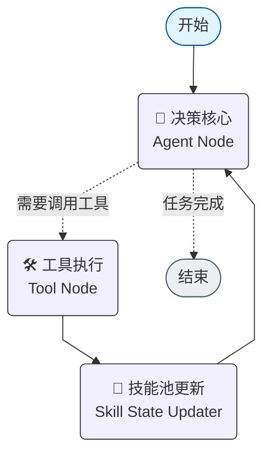

# 🤖 模块化智能体 CLI (Modular Agent CLI)

[](https://www.python.org/downloads/)
[](https://github.com/langchain-ai/langgraph)
[](LICENSE)

这是一个基于 **LangGraph** 和 **OpenAI GPT-4o** 构建的高性能、模块化智能体命令行工具。它专为中文开发者环境深度定制，不仅是一个简单的 CLI 包装，更是一套具备自愈能力和透明思维的 Agent 运行框架。

## ✨ 核心亮点

### 🧠 思考透明化 (Inner Monologue)
拒绝黑盒！Agent 在执行任何动作前，必须先在终端输出其“内心独白”。通过展示思维逻辑，让开发者能够清晰地观测到 Agent 的决策路径。

### 🔌 动态技能插拔 & 严格串行
Agent 采用“零预置”策略。当面临复杂任务时，Agent 会通过 `activate_skill` 动态加载本地技能描述文件。系统强制执行“先加载、再获知路径、后执行脚本”的**严格串行逻辑**，确保了高可靠性。

### 🛡️ 环境自修复 (Env Fix)
针对 Python 开发者最头疼的虚拟环境依赖问题，本工具内置了环境注入逻辑。Agent 启动后会感知当前 Python 解释器环境。执行任何子进程命令时，会自动将 `python/python3` 指令重定向至当前虚拟环境 (`venv`)。

### 🇨🇳 中文开发者友好
*   全中文 CLI 交互界面。
*   全中文代码注释与开发者文档。
*   深度适配中文语境下的任务处理。

---

## 🏗️ 系统架构

系统基于 LangGraph 的有向无环图 (DAG) 架构，确保了任务流转的清晰可控：



---

## 🚀 快速开始

### 1. 环境初始化
推荐使用 Python 3.10 及以上版本。

```bash
# 克隆项目
git clone https://github.com/your-repo/agent-cli.git
cd agent-cli

# 创建并激活虚拟环境
python3 -m venv venv
source venv/bin/activate

# 安装核心依赖
pip install -r requirements.txt
```

### 2. 配置密钥
设置你的 OpenAI API Key。

```bash
export OPENAI_API_KEY="sk-你的密钥"
```

### 3. 运行体验
```bash
python3 main.py
```

---

## 🧩 技能生态 (Skills)

项目通过目录结构定义技能，实现零成本扩展：

*   `web_scraper`: 基于 BeautifulSoup 的自动化网页图片抓取。
*   `image_to_pdf`: 基于 Pillow 的多格式图片转 PDF 工具。
*   `deep-coder`: 针对复杂 Bug 修复的深度编码模式（实验性）。

### 如何添加新技能？
1. 在 `skills/` 下新建目录。
2. 编写 `SKILL.md`：描述技能入口、API 参数及脚本路径。
3. 在 `scripts/` 下放置你的 Python 或 Shell 脚本。

---

## 🛠️ 开发者指南

本项目遵循 [PEP 8](https://www.python.org/dev/peps/pep-0008/) 代码风格规范。在贡献代码前，请确保：
1.  **注释中文化**：所有新增函数必须包含中文 Docstring。
2.  **运行语法检查**：
    ```bash
    python3 -m py_compile **/*.py
    ```

## 📄 开源协议
本项目采用 [MIT License](LICENSE) 开源协议。
